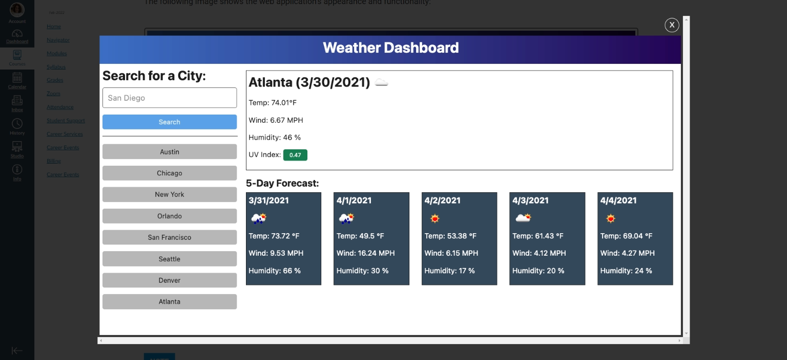
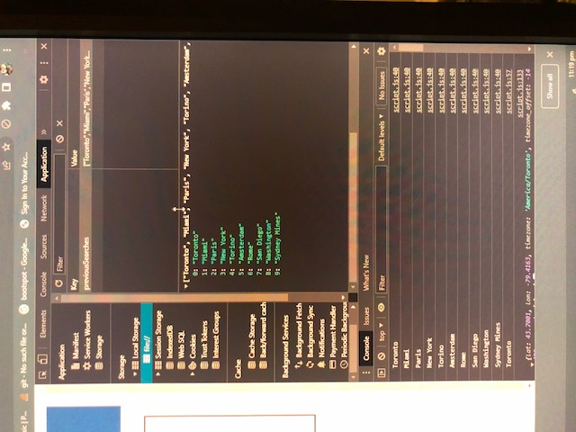
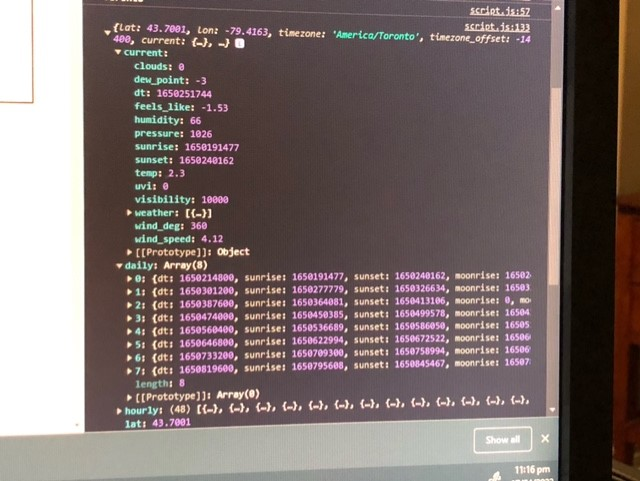
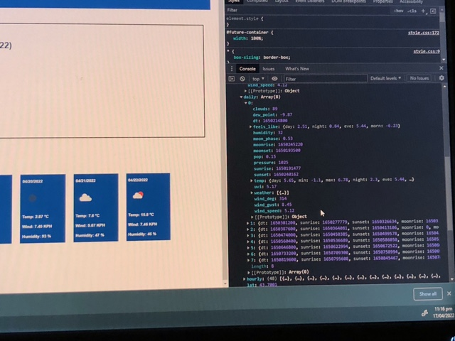
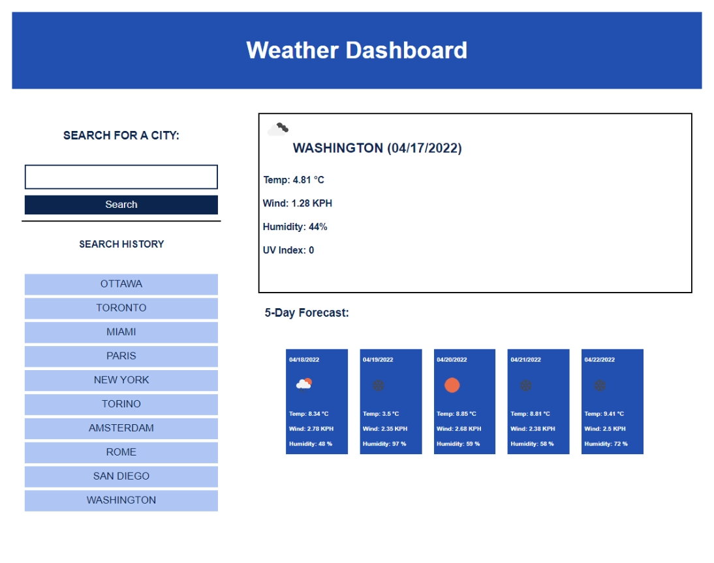

# Module 6 - Weather Dashboard

The purpose of this project is to use JavaScript and concepts learned in Module 6 to create a dynamic weather dashboard using data returned from the OpenWeather One Call API. The weather dashboard should display current weather conditions as well as a future forecast for the next 5 days and should include icons representing the conditions for each day as well as colour-coding the UV index figure based on the degree of severity.  The app must also store previous searches and enable a user to get the forecast for any previous searched locations by clicking the associated button for that location.

The following screenshot provides an example of how the deployed site should appear:

.

## Requirements

the OpenWeather One Call API must be used to retrieve the data to be displayed in the weather dashboard.

## Built With

- HTML
- CSS
- Javascript

## Deployment

This site has been published via [Github Pages](https://lnd4812.github.io/weather-dashboard/).
The repository has been stored on [Github](https://github.com/lnd4812/weather-dashboard.git).

## Design and functionality

The HTML, CSS and Javascript files must be developed from scratch, although I was able to implement several components of the Module 6 instructional project as starter code.  Much of the css for responsiveness was derived from this material.

The dashboard display itself consists of two main sections, the search section which has an input field for the location and an array of buttons below it featuring previously entered locations which are pushed to local storage and displayed in text on the buttons.  Coding to ensure no duplicates, invalid entries or blank entries are added to the search buttons was also employed.

Using an event listener function, when the button is clicked, it fetches data via an api call to one of the OneWeather api's.  Because the one required to produce the acceptance criteria requires latitude and longitude rather than location names to retrieve the forecast details for the location entered, the "weather" api is used to obtain those figures which are subsequently used in the OneWeather One Call api.

Data is extracted from the API call based on current/daily and position of the required display items in the arrays for both.

The Current forecast should include the name of the location, date and feature an icon representing the weather conditions. Temperature, Wind speed, Humidity and the UVI index figures are also required. My coding for the UV Index reflecting a colour representative of the severity needs more work, but the other information is included.  I couldn't for the life of me get the icon positioned correctly, so left it where you see it.

The future forecast includes the same information minus the location and uv index.  

.

## License

An MIT [License](LICENSE) has been included with this project.

## Credits and external Resources

- A full description of Challenge 6's criteria is outlined here: [Module 6 Challenge Project Page](https://courses.bootcampspot.com/courses/1181/assignments/23410?module_item_id=462036).
- Additional assistance was provided by the TA's and fellow learners during Office Hours and through one-on-one tutorial sessions.
- various internet websites including [MDN Docs](https://developer.mozilla.org), [W3Schools](https://www.w3schools.com) and [Stack Overflow](https://stackoverflow.com).

## Task list

[ ] Corrections for any ongoing issues where acceptance criteria not met:
- UV index severity display 
- clearing current and future containers for next search without having to refresh screen
- correcting order of "previous search buttons to show most recent on top in line with array order - too many error messages using reverse().
- reformatting future forecast through for loop(s) - my coding is missing something and the long way at least meets the acceptance criteria, so something to work on for resubmission.
- I'd like to be able to refine search to include country, possibly even province/state at some point.

## Contribution

Laurel David (github.com/lnd4812)

## Contact Information

For any questions, comments and/or issues, please contact me at email: laureldavid64@gmail.com.
